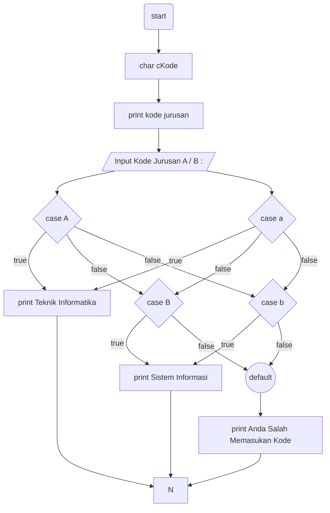

```mermaid
    flowchart TD;
    A(start) --> B[char cKode];
    B --> C[print kode jurusan]
    C --> D[/Input Kode Jurusan A / B : /];
    D --> E{case A};
    D --> F{case a};
    E --true--> G[print Teknik Informatika];
    F --true--> G[print Teknik Informatika];
    E & F--false--> H{case B};
    E & F --false--> I{case b};
    H --true--> J[print Sistem Informasi]
    I --true--> J[print Sistem Informasi]
    H --false--> L((default));
    I --false--> L((default));
    L -->M[print Anda Salah Memasukan Kode]
    M & G & J --> N
```