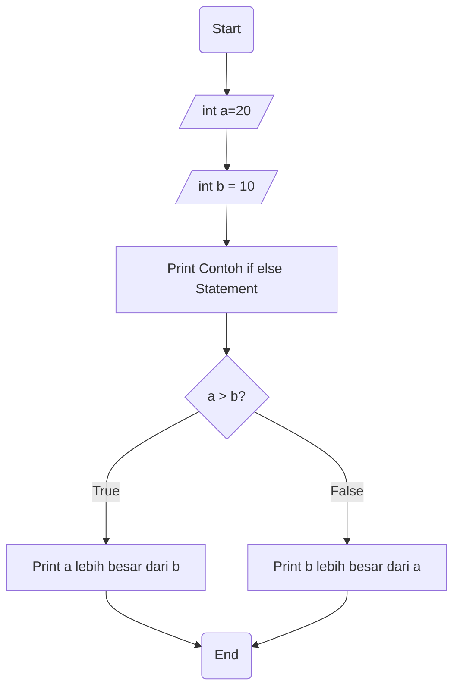

```mermaid
    flowchart TD;
    A(Start) --> B[/int a=20/]
    B --> C[/int b = 10/]
    C --> D[Print Contoh if else Statement]
    D --> E{a > b?}
    E -- True ---> F[Print a lebih besar dari b]
    E -- False---> G[Print b lebih besar dari a]
    F & G --> H(End)
```